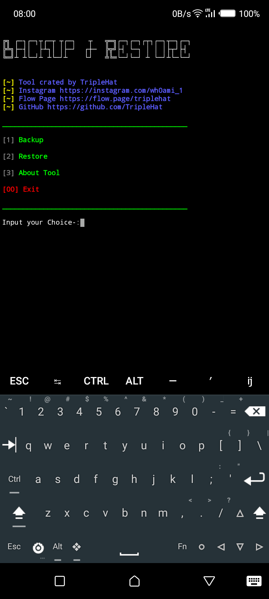

# Backup & Restore
*Backup and Restore THIS TOOL IS FOR TERMUX USERS, THIS TOOL WILL HELP TO BACKUP ALL YOUR DATA INCLUDING TOOLS YOU INSTALLED, PACKAGES, AND EVERYTHING YOU KEEP IN TERMUX. BY DOING BACKUP YOU CANT LOSE YOUR DATA* :)
# Installation
pkg install git -y && git clone https://github.com/TripleHat/Backup-Restore && chmod +x install.sh && ./install.sh && ./backup-restore.sh

## [📱] CONTACT ME

-[Flow page](https://flaw.page/triplehat)
-[Instagram](https://instagram.com/wh0ami_1)
</img>
